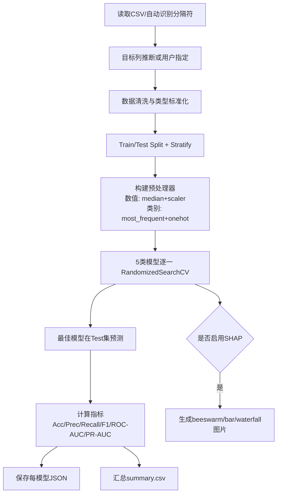
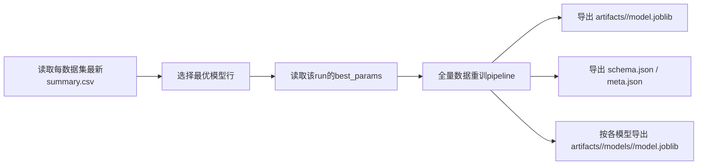

# 心血管风险预测项目实施说明（代码-论文对齐版）

## 1. 项目当前状态总览

本仓库目前已经完成了从**多数据集实验**到**系统落地部署**的完整链路，核心包括：

1. 三个数据集的统一实验管线（训练、调参、评估、可解释性输出）
2. 五个模型的横向比较（LR / RF / XGB / LightGBM / CatBoost）
3. SHAP 全局与局部解释图自动生成
4. 基于最佳模型（以及各模型备份）的推理工件导出
5. Streamlit 交互系统（预测 + SHAP 展示 + 批量预测 + 报告导出能力的基础）

---

## 2. 目录与模块职责

### 2.1 根目录关键文件

- `run_experiments.py`：实验入口（薄封装）
- `build_system_artifacts.py`：将实验最优参数重建为部署模型并导出 artifacts
- `app.py`：系统前端入口（Streamlit）
- `requirements.txt`：依赖清单
- `heart_disease_uci.csv` / `framingham.csv` / `cardio_train.csv`：三数据集

### 2.2 核心包 `heart_cdss/`

- `data.py`：CSV 自动分隔符识别（`,` / `;`）与读取
- `preprocess.py`：缺失值、类型处理、One-Hot、标准化
- `models.py`：模型定义 + 搜索空间
- `metrics.py`：分类指标计算（Accuracy/F1/ROC-AUC/PR-AUC 等）
- `experiment.py`：实验主流程（CV + 调参 + 指标 + 结果落盘 + SHAP）
- `explain.py`：SHAP 图生成（beeswarm/bar/waterfall）
- `persist.py`：joblib/json 持久化
- `audit.py`：预测日志记录
- `reporting.py`：PDF 报告生成
- `cli.py`：命令行参数入口

### 2.3 结果与工件目录

- `results/`：实验输出（summary.csv + 每模型 json + SHAP png）
- `artifacts/`：部署工件（每数据集 best model + 全模型版本）
- `logs/`：系统预测日志

---

## 3. 数据集实施情况

| 数据集 | 文件 | 目标列 | 规模（已跑实验） | 任务定义 |
|---|---|---|---|---|
| UCI Cleveland | `heart_disease_uci.csv` | `num`（转二分类） | train=243 / test=61 | 当前心脏病风险（二分类） |
| Framingham | `framingham.csv` | `TenYearCHD` | train=3392 / test=848 | 10年CHD风险（二分类） |
| Cardio 70k | `cardio_train.csv` | `cardio` | train=56000 / test=14000 | 心血管疾病风险（二分类） |

说明：

- UCI 的 `num` 在代码中按 `num > 0 => 1` 转换为二分类
- `cardio_train.csv` 使用 `;` 分隔符，已由读取模块自动识别
- 不同数据集标签定义存在医学语义差异，当前采用“各数据集内模型对比”的实验策略

---

## 4. 模型与实验流程

### 4.1 模型集合

- Logistic Regression（baseline，可解释）
- Random Forest
- XGBoost
- LightGBM
- CatBoost

### 4.2 实验主流程（当前实现）



### 4.3 评估指标

- Accuracy
- Precision
- Recall
- F1
- ROC-AUC
- PR-AUC
- Confusion Matrix（写入模型 json）

---

## 5. 实验结果（当前已有）

### 5.1 UCI Cleveland（`results/uci_cleveland/20260331_195712_summary.csv`）

- 综合表现较强模型：RF / XGB / LGBM
- 代表性结果：
  - RF：`test_accuracy=0.918`，`test_f1=0.915`
  - XGB：`test_roc_auc=0.965`

### 5.2 Framingham（`results/framingham/20260331_173648_summary.csv`）

- 类别不平衡特征明显：Accuracy 偏高但 Recall/F1 在部分模型较低
- 代表性结果：
  - LR：`test_roc_auc=0.700`，`test_recall=0.605`（召回相对更高）
  - Cat/XGB/LGBM：accuracy 高但 recall 偏低（阈值与不平衡影响明显）

### 5.3 Cardio70k（`results/cardio70k/20260331_174410_summary.csv`）

- Boosting 系列与 RF 在该数据集表现接近
- 代表性结果：
  - XGB：`test_accuracy=0.735`，`test_roc_auc=0.800`
  - Cat：`test_accuracy=0.733`，`test_roc_auc=0.800`

---

## 6. SHAP 可解释性实现与产物

### 6.1 当前实现能力

- 全局解释：
  - SHAP Beeswarm
  - SHAP Bar
- 局部解释：
  - SHAP Waterfall（指定样本索引）

### 6.2 图像落盘路径

- UCI 示例目录：`results/uci_cleveland/`
- 运行期系统生成目录：
  - `results/<dataset>/shap_global/`
  - `results/<dataset>/shap_app/`

### 6.3 现有图片示例（可直接打开）

- 全局条形图（UCI）  
  

- 全局beeswarm（UCI）  
  

- 局部waterfall（UCI）  
  

---

## 7. 系统（部署）流程与现状

### 7.1 工件构建流程



### 7.2 artifacts 结构（已生成）

- `artifacts/uci_cleveland/`
- `artifacts/framingham/`
- `artifacts/cardio70k/`

每个目录包含：

- `model.joblib`（best model）
- `schema.json`（前端输入 schema）
- `meta.json`（最佳模型来源、指标、可用模型列表）
- `models/<model>/model.joblib`（全模型版本，用于对比）

### 7.3 Streamlit 系统现状

当前 `app.py` 为可运行版本，主要提供：

1. 单样本预测（阈值判定）
2. SHAP 全局/局部图生成
3. SHAP Gallery 浏览
4. 预测日志写入（`logs/predictions.csv`）
5. PDF 报告导出基础能力

> 说明：`app.py` 中仍保留了一段历史迭代代码块（未作为函数入口执行），属于“可清理技术债”，不影响当前运行入口 `main()`。

---

## 8. 与论文目标的契合性说明（重点）

## 8.1 论文主张 vs 代码实现对照

| 论文目标 | 代码实现情况 | 对齐度 |
|---|---|---|
| 多数据集比较（small/medium/large） | 已完成 3 数据集流程与结果产出 | 高 |
| 多算法比较（≥5） | 已完成 LR/RF/XGB/LGBM/Cat | 高 |
| 统一实验协议（CV + 调参） | 已有 StratifiedKFold + RandomizedSearchCV | 高 |
| 可解释性（SHAP） | 已支持全局/局部图 + 落盘 + 系统展示 | 高 |
| 系统原型（CDSS） | 已有 Streamlit 系统与工件部署链路 | 高 |
| 可用性评价（如 SUS） | 暂未在代码层实现问卷采集模块 | 中 |
| 统计显著性检验（DeLong/McNemar） | 暂未实现 | 中 |

## 8.2 目前最能支撑论文答辩的证据链

1. `results/*_summary.csv`：三数据集五模型的可比指标表
2. `results/**/*shap*.png`：解释性证据
3. `artifacts/*`：从实验到系统部署的可复现工件
4. `app.py` + `logs/predictions.csv`：可运行系统与使用记录能力

---

## 9. 关键命令（复现实验与系统）

### 9.1 运行实验

```bash
py run_experiments.py --dataset uci_cleveland --csv "C:\Users\13363\Desktop\code\algorithm\heart_disease_uci.csv" --target num --n-iter 20 --cv-folds 5 --shap
py run_experiments.py --dataset framingham --csv "C:\Users\13363\Desktop\code\algorithm\framingham.csv" --target TenYearCHD --n-iter 25 --cv-folds 5
py run_experiments.py --dataset cardio70k --csv "C:\Users\13363\Desktop\code\algorithm\cardio_train.csv" --target cardio --n-iter 8 --cv-folds 3
```

### 9.2 构建系统工件

```bash
py build_system_artifacts.py
```

### 9.3 启动系统

```bash
py -m streamlit run app.py --server.port 8507 --server.address localhost
```

---

## 10. 代码层面的下一步优化建议（论文加分项）

1. 在 `app.py` 清理历史遗留未执行代码块，降低维护复杂度
2. 增加“模型校准曲线/Brier Score”可视化，强化医疗决策可靠性论证
3. 增加统计显著性检验模块（DeLong/McNemar）
4. 增加 SUS 问卷页面与结果聚合（直接支撑论文可用性章节）
5. 增加统一 `config` 配置文件，减少硬编码路径与参数

---

## 11. 关键文件快速索引

- 实验入口：`run_experiments.py`
- CLI 参数：`heart_cdss/cli.py`
- 实验主流程：`heart_cdss/experiment.py`
- 模型与搜索空间：`heart_cdss/models.py`
- 预处理：`heart_cdss/preprocess.py`
- SHAP：`heart_cdss/explain.py`
- 工件构建：`build_system_artifacts.py`
- 系统前端：`app.py`
- 系统日志：`logs/predictions.csv`
- 实验结果：`results/`
- 部署工件：`artifacts/`

---

## 12. 后续 ToDo（Demo 后升级路线）

### 12.1 周三导师 Demo 前（必须完成）

- [ ] **统一实验口径**：三数据集全部使用 `8:2 split + 5-fold CV`（当前 cardio70k 结果为 3 折，需要补跑 5 折版本）
- [ ] **结果总表**：整理 `dataset × model` 的主结果表（Accuracy/F1/Recall/ROC-AUC/PR-AUC）
- [ ] **SHAP 展示图**：每个数据集至少准备 1 张全局图（bar）+ 1 张局部图（waterfall）
- [ ] **系统演示脚本**：固定 1 组手工输入 + 1 个批量 CSV 示例，确保 3 分钟内稳定演示
- [ ] **风险说明**：准备“不同数据集任务定义不同”的口径说明，避免答辩时被质疑跨数据集可比性

### 12.2 Demo 后第一阶段（实验增强）

- [ ] **类别不平衡策略对比**：class_weight / 阈值优化 /（可选）SMOTE 的对比实验
- [ ] **模型校准**：加入 Brier Score + calibration curve，增强临床可用性论证
- [ ] **统计稳定性**：为关键指标增加置信区间（bootstrap 或等效方法）
- [ ] **复杂度分析**：输出训练耗时、推理耗时、模型体积（部署成本证据）
- [ ] **可复现性**：固定随机种子、记录环境版本、统一结果导出命名规则

### 12.3 Demo 后第二阶段（系统增强）

- [ ] **多模型同屏比较**：同一患者输入下展示 5 模型并排风险概率
- [ ] **批量高风险筛选**：批量预测后按风险排序并导出 Top-N 高风险清单
- [ ] **报告自动化**：完善 PDF 报告内容（输入、阈值、预测、SHAP、模型卡）
- [ ] **日志管理页**：在系统内可筛选、查看、导出历史预测日志
- [ ] **异常输入校验**：为关键字段增加规则校验（范围、必填、逻辑关系）

### 12.4 论文与答辩增强（加分项）

- [ ] **方法章节补充**：明确“各数据集内比较，不做跨任务合并训练”的方法边界
- [ ] **结果章节补充**：加入失败案例/误判案例分析（结合 SHAP）
- [ ] **可用性评估实现**：加入 SUS 问卷采集页面与结果统计
- [ ] **统计检验增强**：补充显著性检验（如 DeLong/McNemar）并给出结论口径
- [ ] **附录完善**：补充关键命令、参数表、目录说明、版本信息

### 12.5 交付清单（最终版）

- [ ] 三数据集五模型统一口径实验结果（CSV + 图）
- [ ] SHAP 图集（全局 + 局部）
- [ ] 可运行系统（含批量预测与报告导出）
- [ ] 工件目录（artifacts）与启动说明
- [ ] 论文结果表与答辩演示材料（图表统一）
