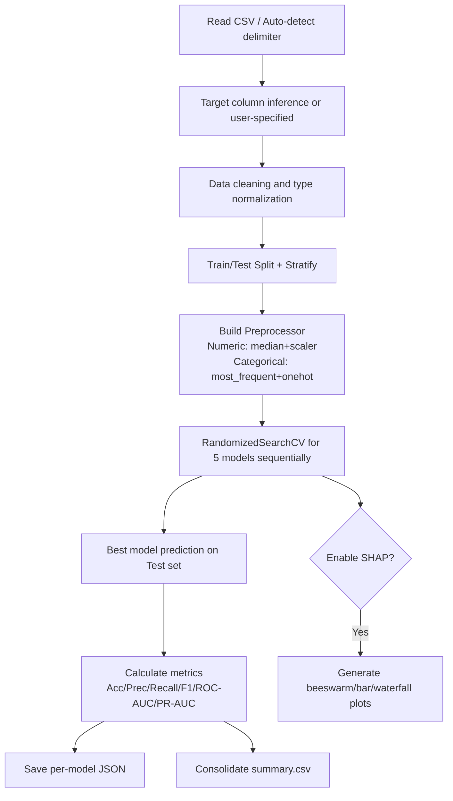
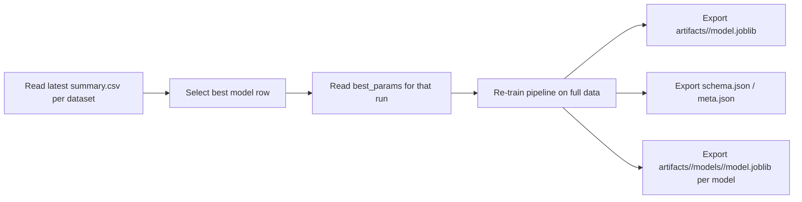

# Cardiovascular Risk Prediction Project Implementation Notes (Code-Paper Alignment Version)

## 1. Project Status Overview

This repository has completed the full pipeline from **multi-dataset experiments** to **system deployment**, including:

1. Unified experimental pipeline for three datasets (training, tuning, evaluation, interpretability output).
2. Side-by-side comparison of five models (LR / RF / XGB / LightGBM / CatBoost).
3. Automatic generation of SHAP global and local explanation plots.
4. Inference artifact export based on the best model (and backups for each model).
5. Streamlit interactive system (Prediction + SHAP display + Batch prediction + PDF report export base).

---

## 2. Directory and Module Responsibilities

### 2.1 Root Directory Key Files

- `run_experiments.py`: Experiment entry point (thin wrapper).
- `build_system_artifacts.py`: Rebuilds deployment models using optimal parameters and exports artifacts.
- `app.py`: System frontend entry point (Streamlit).
- `requirements.txt`: Dependency list.
- `heart_disease_uci.csv` / `framingham.csv` / `cardio_train.csv`: The three datasets.

### 2.2 Core Package `heart_cdss/`

- `data.py`: Automatic CSV delimiter detection (`,` / `;`) and reading.
- `preprocess.py`: Missing value handling, type processing, One-Hot encoding, and scaling.
- `models.py`: Model definitions + search spaces.
- `metrics.py`: Classification metrics calculation (Accuracy/F1/ROC-AUC/PR-AUC, etc.).
- `experiment.py`: Main experiment workflow (CV + Tuning + Metrics + Results Persistence + SHAP).
- `explain.py`: SHAP plot generation (beeswarm/bar/waterfall).
- `persist.py`: joblib/json persistence.
- `audit.py`: Prediction logging.
- `reporting.py`: PDF report generation.
- `cli.py`: Command-line argument entry.

### 2.3 Results and Artifacts Directories

- `results/`: Experiment outputs (summary.csv + per-model json + SHAP png).
- `artifacts/`: Deployment artifacts (best model per dataset + versioned models).
- `logs/`: System prediction logs.

---

## 3. Dataset Implementation Status

| Dataset | File | Target Column | Scale (Experiments Run) | Task Definition |
|---|---|---|---|---|
| UCI Cleveland | `heart_disease_uci.csv` | `num` (binary converted) | train=243 / test=61 | Current Heart Disease Risk (Binary) |
| Framingham | `framingham.csv` | `TenYearCHD` | train=3392 / test=848 | 10-year CHD Risk (Binary) |
| Cardio 70k | `cardio_train.csv` | `cardio` | train=56000 / test=14000 | Cardiovascular Disease Risk (Binary) |

Note:

- UCI's `num` is converted to binary in code as `num > 0 => 1`.
- `cardio_train.csv` uses `;` delimiter, automatically recognized by the reader module.
- Different dataset label definitions have medical semantic differences; current strategy is "intra-dataset model comparison".

---

## 4. Models and Experimental Workflow

### 4.1 Model Suite

- Logistic Regression (baseline, interpretable)
- Random Forest
- XGBoost
- LightGBM
- CatBoost

### 4.2 Main Experimental Workflow (Current Implementation)



### 4.2.1 Preprocessing Details

Preprocessing is implemented by `build_preprocessor()` in `heart_cdss/preprocess.py` using a `ColumnTransformer`:

- Numeric features: median imputation + standardization
- Categorical features: most-frequent imputation + one-hot encoding
- Low-cardinality integers: if a column is integer-typed and has `<= 10` unique values in the training set, it is treated as categorical

Note: The low-cardinality rule depends on pandas dtypes. If a column contains missing values, pandas may load it as float, in which case it will not be considered an “integer low-cardinality” column and will be treated as numeric.

**Term Definitions**

- Median imputation: Fill missing values in numeric columns using the median computed on the training set (robust to outliers).
- Standardization: Apply z-score scaling to numeric columns, `x' = (x - mean) / std`, to reduce unit/scale differences (especially helpful for LR).
- Most-frequent imputation: Fill missing values in categorical columns using the most common category in the training set.
- One-hot encoding: Expand a categorical column into multiple binary indicator columns.
- Low cardinality: Integer-coded columns with very few distinct values (e.g., 0/1, 1/2/3) often represent discrete levels and are treated as categorical features.

**Which Fields Use Which Steps (By Default Rules)**

The model input feature matrix is `X`: the target column (`num` / `TenYearCHD` / `cardio`) and identifier-like columns (e.g., `id`) are removed first, and the remaining columns are split into numeric vs categorical pipelines.

1) UCI Cleveland (`heart_disease_uci.csv`, target `num`)

- Numeric (median + standardization): `age`, `trestbps`, `chol`, `thalch`, `oldpeak`
- Categorical (most-frequent + one-hot): `sex`, `dataset`, `cp`, `restecg`, `slope`, `thal`
- Low-cardinality integers → categorical (most-frequent + one-hot): `fbs`, `exang`, `ca`
- Dropped: `num` (target), `id` (identifier)

2) Framingham (`framingham.csv`, target `TenYearCHD`)

- Numeric (median + standardization): `age`, `cigsPerDay`, `totChol`, `sysBP`, `diaBP`, `BMI`, `heartRate`, `glucose` (and any columns loaded as float)
- Low-cardinality integers → categorical (most-frequent + one-hot, depends on dtype): `male`, `education`, `currentSmoker`, `BPMeds`, `prevalentStroke`, `prevalentHyp`, `diabetes` (and other 0/1 or few-level integer columns)
- Dropped: `TenYearCHD` (target)

3) Cardio 70k (`cardio_train.csv`, target `cardio`)

- Numeric (median + standardization): `age`, `height`, `weight`, `ap_hi`, `ap_lo`
- Low-cardinality integers → categorical (most-frequent + one-hot): `gender`, `cholesterol`, `gluc`, `smoke`, `alco`, `active`
- Dropped: `cardio` (target), `id` (identifier)

### 4.3 Evaluation Metrics

- Accuracy
- Precision
- Recall
- F1
- ROC-AUC
- PR-AUC
- Confusion Matrix (included in model json)

---

## 5. Experimental Results (Current)

### 5.1 UCI Cleveland (`results/uci_cleveland/20260331_195712_summary.csv`)

- Strong performers: RF / XGB / LGBM
- Representative results:
  - RF: `test_accuracy=0.918`, `test_f1=0.915`
  - XGB: `test_roc_auc=0.965`

### 5.2 Framingham (`results/framingham/20260331_173648_summary.csv`)

- Class imbalance is evident: Accuracy is high but Recall/F1 can be lower for some models.
- Representative results:
  - LR: `test_roc_auc=0.700`, `test_recall=0.605` (Relatively higher recall)
  - Cat/XGB/LGBM: High accuracy but lower recall (Threshold and imbalance impact).

### 5.3 Cardio70k (`results/cardio70k/20260331_174410_summary.csv`)

- Boosting series and RF perform similarly on this dataset.
- Representative results:
  - XGB: `test_accuracy=0.735`, `test_roc_auc=0.800`
  - Cat: `test_accuracy=0.733`, `test_roc_auc=0.800`

---

## 6. SHAP Interpretability Implementation and Outputs

### 6.1 Current Capabilities

- Global Interpretation:
  - SHAP Beeswarm
  - SHAP Bar
- Local Interpretation:
  - SHAP Waterfall (for specified sample index)

### 6.2 Image Output Paths

- UCI Example Directory: `results/uci_cleveland/`
- Runtime System Generated Directories:
  - `results/<dataset>/shap_global/`
  - `results/<dataset>/shap_app/`

### 6.3 Existing Image Examples (Click to Open)

- Global Bar Chart (UCI)  
  

- Global Beeswarm (UCI)  
  

- Local Waterfall (UCI)  
  

---

## 7. System (Deployment) Workflow and Status

### 7.1 Artifact Build Workflow



### 7.2 Artifact Structure (Already Generated)

- `artifacts/uci_cleveland/`
- `artifacts/framingham/`
- `artifacts/cardio70k/`

Each directory contains:

- `model.joblib` (best model)
- `schema.json` (frontend input schema)
- `meta.json` (best model source, metrics, available models list)
- `models/<model>/model.joblib` (full model versions for comparison)

### 7.3 Streamlit System Status

Current `app.py` is the runnable version, providing:

1. Single sample prediction (threshold-based decision)
2. SHAP Global/Local plot generation
3. SHAP Gallery browsing
4. Prediction log writing (`logs/predictions.csv`)
5. PDF report export capability foundation

> Note: A legacy code block remains in `app.py` (not executed in the main entry); it's considered "technical debt" to be cleaned and does not affect the current `main()` entry.

---

## 8. Alignment with Thesis Goals (Crucial)

## 8.1 Thesis Objectives vs. Code Implementation

| Thesis Goal | Code Implementation Status | Alignment |
|---|---|---|
| Multi-dataset comparison (small/medium/large) | 3 dataset pipelines and results completed | High |
| Multi-algorithm comparison (≥5) | LR/RF/XGB/LGBM/Cat completed | High |
| Unified experimental protocol (CV + Tuning) | StratifiedKFold + RandomizedSearchCV in place | High |
| Interpretability (SHAP) | Global/Local plots + persistence + UI display supported | High |
| System Prototype (CDSS) | Streamlit system and artifact deployment pipeline ready | High |
| Usability Evaluation (e.g., SUS) | Questionnaire collection module not yet implemented | Medium |
| Statistical Significance Tests (DeLong/McNemar) | Not yet implemented | Medium |

## 8.2 Key Evidence Chain for Thesis Defense

1. `results/*_summary.csv`: Comparative metrics table for 3 datasets and 5 models.
2. `results/**/*shap*.png`: Interpretability evidence.
3. `artifacts/*`: Reproducible artifacts from experiment to system deployment.
4. `app.py` + `logs/predictions.csv`: Runnable system and usage logging capability.

---

## 9. Key Commands (Experiment and System)

### 9.1 Running Experiments

```bash
py run_experiments.py --dataset uci_cleveland --csv "C:\Users\13363\Desktop\code\algorithm\heart_disease_uci.csv" --target num --n-iter 20 --cv-folds 5 --shap
py run_experiments.py --dataset framingham --csv "C:\Users\13363\Desktop\code\algorithm\framingham.csv" --target TenYearCHD --n-iter 25 --cv-folds 5
py run_experiments.py --dataset cardio70k --csv "C:\Users\13363\Desktop\code\algorithm\cardio_train.csv" --target cardio --n-iter 8 --cv-folds 3
```

### 9.2 Building System Artifacts

```bash
py build_system_artifacts.py
```

### 9.3 Launching the System

```bash
py -m streamlit run app.py --server.port 8507 --server.address localhost
```

---

## 10. Future System Evolution and Academic Optimization

1. Clean up legacy code blocks in `app.py` to reduce system maintenance complexity.
2. Incorporate "Model Calibration Curves / Brier Score" visualization to strengthen the clinical reliability of medical decisions.
3. Supplement statistical significance test modules (DeLong/McNemar) to enhance the academic rigor of algorithm comparisons.
4. Integrate SUS questionnaire pages and automated result aggregation (directly supporting the usability analysis chapter of the thesis).
5. Establish a unified `config` configuration system to improve system decoupling and portability.

---

## 11. Key File Quick Index

- Experiment Entry: `run_experiments.py`
- CLI Parameters: `heart_cdss/cli.py`
- Experiment Main Workflow: `heart_cdss/experiment.py`
- Models and Search Spaces: `heart_cdss/models.py`
- Preprocessing: `heart_cdss/preprocess.py`
- SHAP: `heart_cdss/explain.py`
- Artifact Building: `build_system_artifacts.py`
- System Frontend: `app.py`
- System Logs: `logs/predictions.csv`
- Experiment Results: `results/`
- Deployment Artifacts: `artifacts/`

---

## 12. Post-Demo ToDo (Roadmap after Wednesday)

### 12.1 Core Functional Refinement and System Demonstration Preparation

- [ ] **Unify Experimental Protocol**: Use `8:2 split + 5-fold CV` for all 3 datasets (cardio70k current results are 3-fold, need to rerun 5-fold version).
- [ ] **Main Results Table**: Organize a master table of `dataset × model` (Accuracy/F1/Recall/ROC-AUC/PR-AUC).
- [ ] **SHAP Gallery**: Prepare at least 1 global plot (bar) + 1 local plot (waterfall) per dataset.
- [ ] **Demo Script**: Fix 1 set of manual inputs + 1 batch CSV example for a stable and smooth demonstration.
- [ ] **Technical Justification**: Prepare technical explanations for "different task definitions across datasets" to ensure logical consistency of the experimental design.

### 12.2 System Optimization Phase 1 (Experimental Enhancement)

- [ ] **Class Imbalance Strategy Comparison**: Comparative experiments on class_weight / threshold optimization / (Optional) SMOTE.
- [ ] **Model Calibration**: Include Brier Score + calibration curve to enhance clinical usability arguments.
- [ ] **Statistical Stability**: Add confidence intervals for key metrics (bootstrap or equivalent).
- [ ] **Complexity Analysis**: Output training time, inference time, and model size (evidence for deployment cost).
- [ ] **Reproducibility**: Fix random seeds, record environment versions, and unify result export naming rules.

### 12.3 System Optimization Phase 2 (System Enhancement)

- [ ] **Multi-model Side-by-Side Comparison**: Display risk probabilities for 5 models side-by-side for the same patient input.
- [ ] **Batch High-Risk Screening**: Sort by risk after batch prediction and export Top-N high-risk list.
- [ ] **Report Automation**: Refine PDF report content (Input, Threshold, Prediction, SHAP, Model Card).
- [ ] **Log Management Page**: Filter, view, and export historical prediction logs within the system.
- [ ] **Input Validation**: Add rule-based validation for key fields (range, required, logical relations).

### 12.4 Enhancing Thesis Depth and Defense Argumentation

- [ ] **Methods Chapter Supplement**: Clearly define the boundary of "intra-dataset comparison, no cross-task combined training".
- [ ] **Results Chapter Supplement**: Include failure/misclassification case analysis (using SHAP).
- [ ] **Usability Evaluation Implementation**: Add SUS questionnaire collection page and statistical results.
- [ ] **Statistical Testing Enhancement**: Supplement significance tests (e.g., DeLong/McNemar) and provide conclusion narratives.
- [ ] **Appendix Refinement**: Supplement key commands, parameter tables, directory descriptions, and version info.

### 12.5 Final Delivery Checklist

- [ ] Unified protocol experiment results for 3 datasets and 5 models (CSV + Plots).
- [ ] SHAP Image Collection (Global + Local).
- [ ] Runnable system (with batch prediction and report export).
- [ ] Artifacts directory and startup instructions.
- [ ] Thesis results tables and defense presentation materials (unified visuals).
